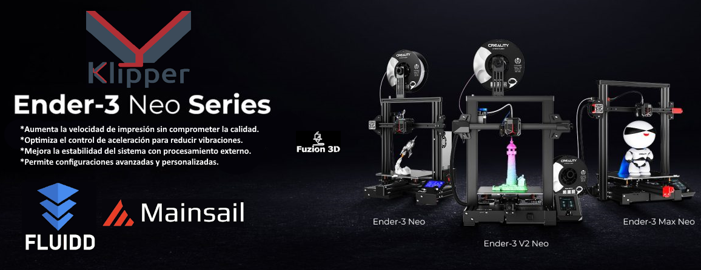

# 🚀 Klipper para la Familia Ender 3 Neo – Firmware y Configuración  

  

## 📌 ¿Qué encontrarás en este repositorio?  
Este repositorio está diseñado para facilitar la instalación de **Klipper en toda la familia Ender 3 Neo de Creality**, garantizando compatibilidad con la placa original. No necesitas compilar nada, simplemente flashea el firmware y carga la configuración en Mainsail o Fluidd.  

✔ **Firmware Klipper (`firmware.bin`) listo para flashear**  
✔ **Archivo `printer.cfg` configurado para la familia Ender 3 Neo**  
✔ **Compatibilidad con Mainsail y Fluidd**  
✔ **Guía de instalación paso a paso**  

---

## ⚡ Beneficios de Klipper en la Ender 3 Neo  
- **Aumento de la velocidad de impresión sin perder calidad.**  
- **Control de aceleración optimizado para reducir vibraciones.**  
- **Procesamiento en Raspberry Pi**, liberando recursos de la placa principal.  
- **Configuraciones avanzadas y personalización completa.**  
- **Compatibilidad total con interfaces web como Mainsail y Fluidd.**  

---

## 🔧 Instalación del Firmware en la Ender 3 Neo  
1. **Descarga el archivo `firmware.bin`** desde este repositorio.  
2. **Formatea una tarjeta microSD en FAT32.**  
3. **Copia el archivo `firmware.bin`** a la raíz de la microSD.  
4. **Inserta la tarjeta en la impresora y apágala.**  
5. **Enciende la impresora y espera unos segundos.**  
6. **El firmware se instalará automáticamente.**  
7. **Verifica que el archivo `firmware.bin` cambió de nombre en la SD**, lo que confirma que la actualización fue exitosa.  

---

## 🖥 Instalación de Klipper  
Para instalar Klipper en tu Raspberry Pi, sigue la guía completa disponible en el siguiente repositorio:  

🔗 **[Guía de Instalación de Klipper](https://github.com/dw-0/kiauh)**  

Esta guía te ayudará a instalar **Klipper, Moonraker y la interfaz web Mainsail o Fluidd** de forma rápida y sencilla.  

---

## ⚙️ Configuración en Mainsail / Fluidd  
1. **Sube el archivo `printer.cfg`** a la Fluidd/Mainsail.  
2. **Ajusta los valores de aceleración, velocidad y PID** si es necesario.  
3. **Ejecuta `FIRMWARE_RESTART`** en la consola para aplicar los cambios.  
4. **Realiza una prueba de impresión** para verificar el funcionamiento.  

---

## 🔗 Contribuciones y Comunidad  
Si mejoras la configuración o tienes optimizaciones adicionales, no dudes en hacer un **fork y pull request**.  

📌 **Redes Sociales:**  
- **TikTok:** [@fuzion3d](https://www.tiktok.com/@fuzion3d)  
- **Instagram:** [@fuzion3dcrea](https://www.instagram.com/fuzion3dcrea)  
- **YouTube:** [@fuzion3dcrea](https://youtube.com/@fuzion3dcrea)  

**Optimiza tu Ender 3 Neo con Klipper y lleva tu impresión 3D al siguiente nivel.** 🚀  

